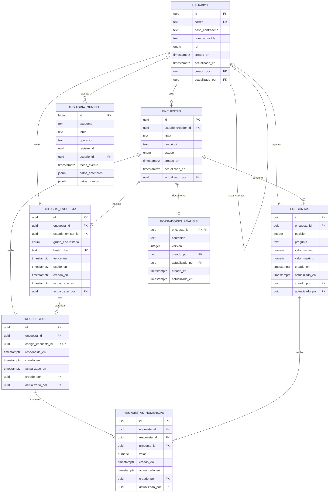

# Modelo entidad-relación

Esquema PostgreSQL: `estadistica`.

```mermaid
erDiagram
    USUARIOS {
        uuid id PK
        text correo UK
        text hash_contrasena
        text nombre_visible
        enum rol
        timestamptz creado_en
        timestamptz actualizado_en
        uuid creado_por FK
        uuid actualizado_por FK
    }

    ENCUESTAS {
        uuid id PK
        uuid usuario_creador_id FK
        text titulo
        text descripcion
        enum estado
        timestamptz creado_en
        timestamptz actualizado_en
        uuid actualizado_por FK
    }

    PREGUNTAS {
        uuid id PK
        uuid encuesta_id FK
        integer posicion
        text pregunta
        numeric valor_minimo
        numeric valor_maximo
        timestamptz creado_en
        timestamptz actualizado_en
        uuid creado_por FK
        uuid actualizado_por FK
    }

    CODIGOS_ENCUESTA {
        uuid id PK
        uuid encuesta_id FK
        uuid usuario_emisor_id FK
        enum grupo_encuestado
        text hash_token UK
        timestamptz vence_en
        timestamptz usado_en
        timestamptz creado_en
        timestamptz actualizado_en
        uuid actualizado_por FK
    }

    RESPUESTAS {
        uuid id PK
        uuid encuesta_id FK
        uuid codigo_encuesta_id FK,UK
        timestamptz respondida_en
        timestamptz creado_en
        timestamptz actualizado_en
        uuid creado_por FK
        uuid actualizado_por FK
    }

    RESPUESTAS_NUMERICAS {
        uuid id PK
        uuid encuesta_id FK
        uuid respuesta_id FK
        uuid pregunta_id FK
        numeric valor
        timestamptz creado_en
        timestamptz actualizado_en
        uuid creado_por FK
        uuid actualizado_por FK
    }

    BORRADORES_ANALISIS {
        uuid encuesta_id PK,FK
        text contenido
        integer version
        uuid creado_por FK
        uuid actualizado_por FK
        timestamptz creado_en
        timestamptz actualizado_en
    }

    AUDITORIA_GENERAL {
        bigint id PK
        text esquema
        text tabla
        text operacion
        uuid registro_id
        uuid usuario_id FK
        timestamptz fecha_evento
        jsonb datos_anteriores
        jsonb datos_nuevos
    }

    USUARIOS ||--o{ ENCUESTAS : crea
    USUARIOS o|--o{ PREGUNTAS : registra
    USUARIOS ||--o{ CODIGOS_ENCUESTA : emite
    USUARIOS o|--o{ AUDITORIA_GENERAL : ejecuta
    USUARIOS o|--o{ USUARIOS : crea_cuentas
    ENCUESTAS ||--o{ PREGUNTAS : contiene
    ENCUESTAS ||--o{ CODIGOS_ENCUESTA : habilita
    ENCUESTAS ||--o{ RESPUESTAS : recibe
    ENCUESTAS ||--o| BORRADORES_ANALISIS : documenta
    CODIGOS_ENCUESTA ||--o| RESPUESTAS : autoriza
    RESPUESTAS ||--|{ RESPUESTAS_NUMERICAS : contiene
    PREGUNTAS ||--o{ RESPUESTAS_NUMERICAS : recibe
```
